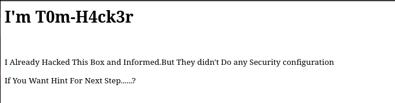
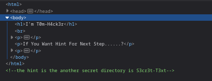
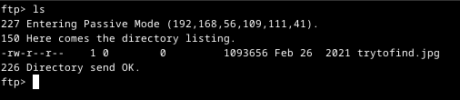
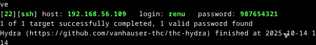
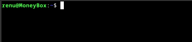
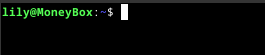
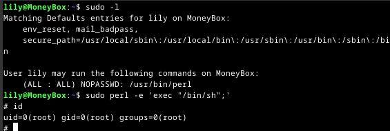

# Moneybox ctf

[vulnhub_link] (https://www.vulnhub.com/entry/moneybox-1,653/)

## Ip finding

`fping -aqg 192.168.xxx.0\24`
> Note: you can use netdiscover,
> in this case the target ip are 192.168.56.109

## Nmap scan

| Port | State | Service |
|-------|-------|--------|
| 21/tcp | open | ftp |
| 22/tcp | open | ssh |
| 80/tcp | open | http |

## Http server

## Enumeration

`gobuster dir -w wordlist.txt -u IP -rx html,php,txt`

> The wordlist i use is seclist

| code 200 directory |
|--------------------|
| /Blog |
| /index.html |

inside /Blog

if we inspect the blog directory we will discover this

accessing the S3cr3t-T3xt give us this

inspecting that page will give us this key

## FTP finding
> nmap scan log shows the ftp server have anon login method

inside the ftp server

if we try to extract the image on ftp server with steghide and use the key on secret text, the image will give us data.txt

> inside data.txt
> 
>       Hello.....  renu
>
>       I tell you something Important.Your Password is too Week So Change Your Password
>       Don't Underestimate it.......

## Bruteforce the ssh

As the data say that renu password is weak, we can try to bruteforce it with hydra

`hydra -l renu -P rockyou.txt ssh://IP -t 4 -w 5 -s 22`

Login as renu

> flag1 found at /home/renu/user1.txt

## Log in as other user

Using `ls -la` command and viewing the `.bash_history`, we can see that renu have `id_rsa` which can be use for log in as other user named `lilly`.

> flag2 found at /home/renu/user2.txt

## Finding the root flag

Running `sudo -l` as lily promted us to this

>       User lily may run the following commands on MoneyBox:
>       (ALL : ALL) NOPASSWD: /usr/bin/perl

Finding suitable command at `gtfo bin` website, we can abuse this and get a root shell

`sudo perl -e 'exec "/bin/sh";'`

and we get the root shell

> root flag found at /root/.root.txt